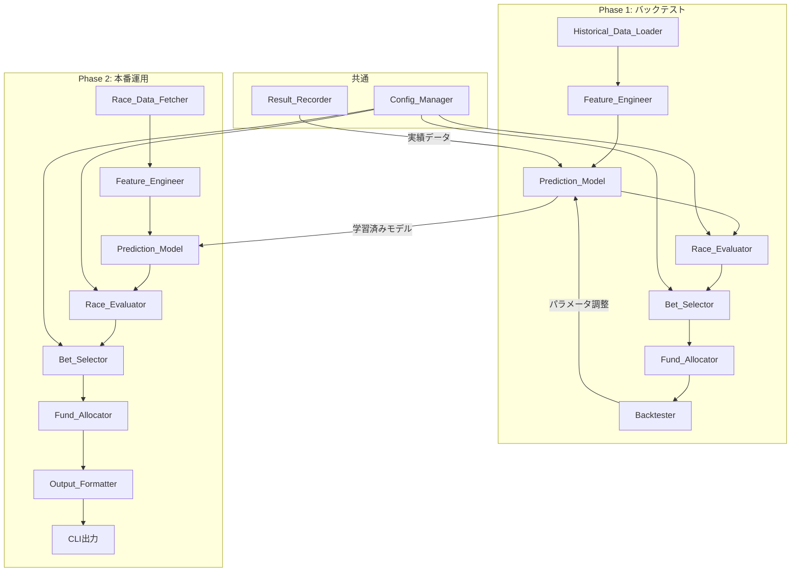
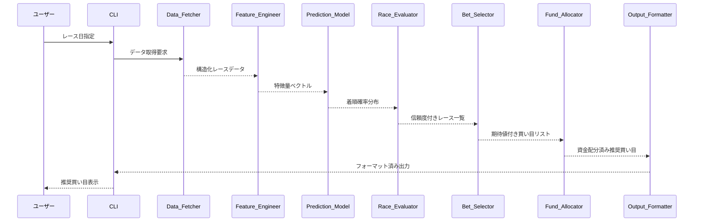

# 技術設計書

## Overview

本システムは、競馬レースの予測を行い回収率を最優先とした厳選された買い目を提案するPythonベースのアドバイスシステムである。自動売買は行わず、ユーザーが手動で馬券を購入するための推奨買い目（1レースあたり最大10点）をCLI経由で出力する。

### 設計方針

- **言語**: Python 3.11+
- **機械学習フレームワーク**: LightGBM（勾配ブースティング決定木、高速かつ高精度）
- **データ取得**: netkeiba.comからのスクレイピング（`keibascraper`ライブラリ活用）
- **アーキテクチャ**: モジュラー設計（各モジュールが独立して動作可能）
- **Phase構成**: Phase 1（バックテスト）で検証済みのモデルをPhase 2（本番運用）で利用

### 技術的判断の根拠

1. **LightGBMの採用理由**: 競馬予測ではGBDT系モデルが最も実績があり、表形式データに対して高い精度を発揮する。LambdaRankによるランキング学習にも対応し、着順予測に適している。
2. **Pythonの採用理由**: データサイエンス・機械学習エコシステムが充実しており、scikit-learn, pandas, numpy等との統合が容易。
3. **CLIベースの採用理由**: レース当日にターミナルから即座に結果を確認でき、自動化スクリプトとの連携も容易。

## Architecture

### システム全体構成



### データフロー



### ディレクトリ構成

```
horse-race-predictor/
├── src/
│   ├── __init__.py
│   ├── cli.py                    # CLIエントリーポイント
│   ├── config.py                 # 設定管理
│   ├── data/
│   │   ├── __init__.py
│   │   ├── historical_loader.py  # 過去データ読み込み
│   │   ├── race_fetcher.py       # 当日データ取得
│   │   ├── data_store.py         # データ永続化（キャッシュ）
│   │   └── models.py             # データモデル定義
│   ├── features/
│   │   ├── __init__.py
│   │   └── engineer.py           # 特徴量エンジニアリング
│   ├── prediction/
│   │   ├── __init__.py
│   │   ├── model.py              # 予測モデル
│   │   └── trainer.py            # モデル学習
│   ├── evaluation/
│   │   ├── __init__.py
│   │   └── race_evaluator.py     # レース評価・見送り判定
│   ├── betting/
│   │   ├── __init__.py
│   │   ├── bet_selector.py       # 買い目選択
│   │   └── fund_allocator.py     # 資金配分
│   ├── backtest/
│   │   ├── __init__.py
│   │   └── backtester.py         # バックテスト実行
│   └── output/
│       ├── __init__.py
│       ├── formatter.py          # 出力フォーマッタ
│       └── result_recorder.py    # 実績記録（永続化対応）
├── tests/
│   ├── __init__.py
│   ├── unit/
│   ├── property/
│   └── integration/
├── data/
│   ├── raw/                      # 生データ（スクレイピング結果のJSON）
│   ├── processed/                # 加工済みデータ（実績記録等）
│   └── models/                   # 学習済みモデル
├── config/
│   └── default.yaml              # デフォルト設定
├── pyproject.toml
└── README.md
```

## Components and Interfaces

### 1. Historical_Data_Loader

過去のレースデータを読み込み、学習・検証用に構造化するモジュール。

```python
class HistoricalDataLoader:
    """過去レースデータの読み込みと前処理を行う"""

    def load_races(self, start_date: date, end_date: date) -> list[RaceData]:
        """指定期間のレースデータを読み込む"""
        ...

    def split_data(
        self, races: list[RaceData], train_ratio: float = 0.8
    ) -> tuple[list[RaceData], list[RaceData]]:
        """学習用と検証用にデータを分割する"""
        ...

    def validate_and_clean(self, races: list[RaceData]) -> CleaningReport:
        """データのバリデーションとクリーニングを行う"""
        ...
```

### 2. Race_Data_Fetcher

レース当日の情報を外部ソースから取得するモジュール。

```python
class RaceDataFetcher:
    """レース当日のデータを取得する"""

    def __init__(self, base_url: str, timeout: int, data_store: DataStore | None):
        """data_store指定時はキャッシュ連携を行う"""
        ...

    def fetch_race_day(self, race_date: date) -> FetchResult:
        """指定日の全レース情報を取得する（キャッシュ優先）"""
        ...

    def fetch_realtime_odds(self, race_id: str) -> OddsData:
        """直前オッズ情報を取得する"""
        ...
```

### 2b. Data_Store

スクレイピング結果や実績記録をJSONファイルとして永続化するモジュール。

```python
class DataStore:
    """レースデータの永続化を管理する"""

    def save_races(self, races: list[RaceData], race_date: date) -> Path:
        """日付単位でレースデータをJSONファイルに保存する"""
        ...

    def save_single_race(self, race: RaceData) -> Path:
        """個別レースを追加・更新保存する"""
        ...

    def has_race_date(self, race_date: date) -> bool:
        """指定日のデータが保存済みか確認する"""
        ...

    def has_race(self, race_id: str, race_date: date) -> bool:
        """指定レースが保存済みか確認する"""
        ...

    def load_race_date(self, race_date: date) -> list[RaceData]:
        """保存済みデータを読み込む"""
        ...

    def get_stored_dates(self) -> list[date]:
        """保存済み日付一覧を返す"""
        ...
```

**データフロー（永続化）:**
```
スクレイピング → DataStore.save_races() → data/raw/YYYY-MM-DD.json
                                              ↓
HistoricalDataLoader.load_races() ← data/raw/*.json

ResultRecorder.record_result() → data/processed/results.json
ResultRecorder.__init__() ← data/processed/results.json（自動読み込み）
```

### 3. Feature_Engineer

生データから予測モデルの入力となる特徴量を生成するモジュール。

```python
class FeatureEngineer:
    """特徴量エンジニアリングを行う"""

    def extract_features(self, race: RaceData, horse: HorseEntry) -> FeatureVector:
        """個別の馬に対する特徴量を抽出する"""
        ...

    def get_feature_names(self) -> list[str]:
        """使用する特徴量名の一覧を返す"""
        ...
```

### 4. Prediction_Model

着順確率を推定する機械学習モデル。

```python
class PredictionModel:
    """LightGBMベースの着順確率推定モデル"""

    def train(self, features: np.ndarray, labels: np.ndarray) -> None:
        """モデルを学習する"""
        ...

    def predict_probabilities(self, race_features: np.ndarray) -> np.ndarray:
        """各馬の着順確率を推定する"""
        ...

    def cross_validate(
        self, features: np.ndarray, labels: np.ndarray, n_splits: int = 5
    ) -> CrossValidationResult:
        """交差検証を実行する"""
        ...

    def save(self, path: Path) -> None:
        """モデルを保存する"""
        ...

    def load(self, path: Path) -> None:
        """モデルを読み込む"""
        ...
```

### 5. Race_Evaluator

各レースの予測信頼度を評価し、参加・見送りを判定するモジュール。

```python
class RaceEvaluator:
    """レースの信頼度スコアを算出し見送り判定を行う"""

    def evaluate(self, race: RaceData, predictions: np.ndarray) -> RaceEvaluation:
        """レースの信頼度スコアと参加判定を行う"""
        ...

    def get_skip_reason(self, evaluation: RaceEvaluation) -> str:
        """見送り理由を生成する"""
        ...
```

### 6. Bet_Selector

期待値に基づいて買い目を選択・絞り込むモジュール。

```python
class BetSelector:
    """期待値に基づく買い目選択"""

    def select_bets(
        self, race: RaceData, probabilities: np.ndarray, max_bets: int = 10
    ) -> list[BetRecommendation]:
        """期待値が閾値を超える買い目を最大max_bets件選択する"""
        ...

    def calculate_expected_value(
        self, probability: float, odds: float
    ) -> float:
        """期待値を計算する"""
        ...
```

### 7. Fund_Allocator

ケリー基準ベースの資金配分を行うモジュール。

```python
class FundAllocator:
    """ケリー基準ベースの資金配分"""

    def allocate(
        self, bets: list[BetRecommendation], budget: int
    ) -> list[AllocatedBet]:
        """予算内で最適な資金配分を算出する"""
        ...

    def apply_kelly_criterion(
        self, probability: float, odds: float, budget: int
    ) -> int:
        """ケリー基準に基づく推奨投資金額を算出する（100円単位）"""
        ...

    def cap_allocation(
        self, allocations: list[AllocatedBet], budget: int, max_ratio: float = 0.3
    ) -> list[AllocatedBet]:
        """単一買い目の配分上限を適用し再配分する"""
        ...
```

### 8. Backtester

過去のレースデータに対してモデルの性能を検証するモジュール。

```python
class Backtester:
    """バックテスト実行エンジン"""

    def run(
        self, races: list[RaceData], model: PredictionModel, config: Config
    ) -> BacktestResult:
        """バックテストを実行する"""
        ...

    def generate_report(self, result: BacktestResult) -> BacktestReport:
        """レポートを生成する"""
        ...
```

### 9. Config_Manager

設定の読み込み・バリデーションを行うモジュール。

```python
class ConfigManager:
    """設定管理"""

    def load(self, path: Path) -> Config:
        """設定ファイルを読み込む"""
        ...

    def validate(self, config: Config) -> ValidationResult:
        """設定値のバリデーションを行う"""
        ...
```

## Data Models

### コアデータモデル

```python
from dataclasses import dataclass, field
from datetime import date, time
from enum import Enum
from typing import Optional


class BetType(Enum):
    """券種"""
    WIN = "単勝"          # 単勝
    PLACE = "複勝"        # 複勝
    QUINELLA = "馬連"     # 馬連
    EXACTA = "馬単"       # 馬単
    WIDE = "ワイド"       # ワイド
    TRIO = "三連複"       # 三連複
    TRIFECTA = "三連単"   # 三連単


class TrackCondition(Enum):
    """馬場状態"""
    FIRM = "良"
    GOOD = "稍重"
    YIELDING = "重"
    SOFT = "不良"


@dataclass(frozen=True)
class HorseEntry:
    """出走馬情報"""
    horse_name: str           # 馬名
    jockey_name: str          # 騎手名
    gate_number: int          # 枠番 (1-8)
    horse_number: int         # 馬番
    weight: Optional[int]     # 馬体重（kg）
    weight_change: Optional[int]  # 馬体重変動（kg）
    win_odds: Optional[float]     # 単勝オッズ


@dataclass(frozen=True)
class RaceResult:
    """レース結果"""
    horse_number: int         # 馬番
    finish_position: int      # 着順


@dataclass(frozen=True)
class PayoutInfo:
    """払い戻し情報"""
    bet_type: BetType         # 券種
    combination: tuple[int, ...]  # 馬番の組み合わせ
    payout: int               # 払い戻し金額（円）


@dataclass(frozen=True)
class RaceData:
    """レースデータ"""
    race_id: str              # レースID
    race_name: str            # レース名
    race_date: date           # 開催日
    post_time: Optional[time] # 発走時刻
    venue: str                # 開催場
    course_type: str          # コースタイプ（芝/ダート）
    distance: int             # 距離（メートル）
    track_condition: TrackCondition  # 馬場状態
    weather: Optional[str]    # 天候
    entries: list[HorseEntry] # 出走馬リスト
    results: Optional[list[RaceResult]]  # レース結果（過去データのみ）
    payouts: Optional[list[PayoutInfo]]  # 払い戻し情報（過去データのみ）


@dataclass(frozen=True)
class FeatureVector:
    """特徴量ベクトル"""
    values: np.ndarray        # 特徴量の値
    feature_names: list[str]  # 特徴量名


@dataclass(frozen=True)
class BetRecommendation:
    """買い目推奨"""
    bet_type: BetType                # 券種
    combination: tuple[int, ...]     # 馬番の組み合わせ
    estimated_probability: float     # 推定的中確率
    estimated_odds: float            # 推定オッズ
    expected_value: float            # 期待値


@dataclass(frozen=True)
class AllocatedBet:
    """資金配分済み買い目"""
    recommendation: BetRecommendation  # 買い目推奨
    amount: int                        # 投資金額（100円単位）


@dataclass(frozen=True)
class RaceEvaluation:
    """レース評価結果"""
    race_id: str                  # レースID
    confidence_score: int         # 信頼度スコア (0-100)
    should_bet: bool              # 投資判定
    skip_reason: Optional[str]    # 見送り理由
    factors: dict[str, float]     # 評価要素（荒れやすさ、実力差、データ充実度）


@dataclass
class BacktestResult:
    """バックテスト結果"""
    total_races: int              # 対象レース数
    bet_races: int                # 投資レース数
    skipped_races: int            # 見送りレース数
    total_investment: int         # 合計投資金額
    total_return: int             # 合計払い戻し金額
    hit_rate: float               # 的中率
    return_rate: float            # 回収率
    max_drawdown: float           # 最大ドローダウン
    sharpe_ratio: float           # シャープレシオ
    daily_returns: list[float]    # 日次リターン
    weekly_returns: list[float]   # 週次リターン
    monthly_returns: list[float]  # 月次リターン
    bet_type_stats: dict[BetType, dict[str, float]]  # 券種別統計


@dataclass(frozen=True)
class Config:
    """システム設定"""
    confidence_threshold: int = 50       # 信頼度スコア閾値 (0-100)
    max_bets_per_race: int = 10          # 1レースあたり最大買い目数
    min_expected_value: float = 1.0      # 期待値最低基準
    daily_budget: int = 10000            # 1日の投資予算（円）
    target_bet_types: list[BetType] = field(
        default_factory=lambda: list(BetType)
    )  # 対象券種
    max_single_bet_ratio: float = 0.3    # 単一買い目の最大配分比率


@dataclass
class CleaningReport:
    """データクリーニングレポート"""
    total_records: int            # 総レコード数
    excluded_count: int           # 除外件数
    exclusion_reasons: list[tuple[str, str]]  # (レースID, 除外理由)
    clean_races: list[RaceData]   # クリーニング済みデータ
```

### 設定ファイルフォーマット（YAML）

```yaml
# config/default.yaml
prediction:
  confidence_threshold: 50      # 信頼度スコア閾値 (0-100)
  max_bets_per_race: 10         # 1レースあたり最大買い目数
  min_expected_value: 1.0       # 期待値最低基準

budget:
  daily_budget: 10000           # 1日の投資予算（円）
  max_single_bet_ratio: 0.3    # 単一買い目の最大配分比率 (30%)

bet_types:                      # 対象券種
  - WIN
  - PLACE
  - QUINELLA
  - EXACTA
  - WIDE
  - TRIO
  - TRIFECTA

data:
  train_ratio: 0.8              # 学習データ比率
  cross_validation_splits: 5    # 交差検証分割数

model:
  type: lightgbm
  params:
    objective: lambdarank
    num_leaves: 31
    learning_rate: 0.05
    n_estimators: 1000
```


## Correctness Properties

*プロパティとは、システムのすべての有効な実行において真であるべき特性や振る舞いのことである。人間が読める仕様と機械で検証可能な正当性保証の橋渡しとなる形式的な記述である。*

### Property 1: 日付範囲フィルタリング

*For any* 有効な日付範囲（start_date, end_date）とレースデータセットに対して、Historical_Data_Loaderが返すすべてのレースの開催日は指定された範囲内（start_date ≤ race_date ≤ end_date）に収まること。

**Validates: Requirements 1.1**

### Property 2: データ分割不変量

*For any* レースデータリストと分割比率（train_ratio）に対して、分割後の学習用データ件数 + 検証用データ件数 = 元の総件数であること。かつ、学習用データの比率は指定比率に近似すること。

**Validates: Requirements 1.2**

### Property 3: 不正データ除外の完全性

*For any* 不正データ（フォーマット不正または必須フィールド欠損）を含むデータセットに対して、クリーニング後のデータには不正レコードが含まれず、除外件数がクリーニングレポートの除外件数と一致すること。

**Validates: Requirements 1.3**

### Property 4: 確率分布の妥当性

*For any* レースの特徴量入力に対して、予測モデルが出力する各馬の着順確率はすべて[0, 1]の範囲内であり、全馬の確率の合計は1.0に近似すること。

**Validates: Requirements 2.1**

### Property 5: 期待値計算の正確性

*For any* 有効な推定的中確率 p（0 < p < 1）と推定オッズ odds（odds > 0）に対して、期待値は p × odds と等しいこと。

**Validates: Requirements 2.3**

### Property 6: 信頼度スコアの範囲と閾値判定

*For any* レース入力に対して、Race_Evaluatorが算出する信頼度スコアは[0, 100]の整数であること。かつ、*for any* 信頼度スコアと閾値の組み合わせに対して、スコア ≥ 閾値のとき投資判定がTrue、スコア < 閾値のとき投資判定がFalseであること。

**Validates: Requirements 3.1, 3.2, 3.3, 3.4**

### Property 7: 買い目選択の制約

*For any* レース予測結果に対して、Bet_Selectorが出力する買い目は以下をすべて満たすこと：(1) 件数が設定された最大買い目数以下、(2) すべての買い目の期待値が設定された最低基準を超える、(3) 各買い目に券種・馬番組み合わせ・推定的中確率・推定オッズ・期待値が含まれる、(4) 買い目は期待値の降順でソートされていること。

**Validates: Requirements 4.1, 4.2, 4.3, 4.4, 4.6**

### Property 8: 資金配分不変量

*For any* 買い目リストと予算に対して、Fund_Allocatorの出力は以下をすべて満たすこと：(1) 全買い目の合計投資金額が予算を超えない、(2) 各買い目の投資金額は100円の倍数である、(3) 単一買い目の投資金額は予算の30%（設定値）を超えない。

**Validates: Requirements 5.1, 5.2, 5.3, 5.5**

### Property 9: ケリー基準の正確性

*For any* 有効な推定的中確率 p と オッズ odds に対して、ケリー基準による推奨配分率は (p × odds - 1) / (odds - 1) の計算結果と一致すること（ただし負の値の場合は0とする）。

**Validates: Requirements 5.4**

### Property 10: バックテスト会計不変量

*For any* バックテスト結果に対して、投資対象レース数 + 見送りレース数 = 全レース数であること。かつ、券種別の投資合計金額の総和 = 全体の合計投資金額であること。

**Validates: Requirements 6.1, 6.4**

### Property 11: 期間集計の正確性

*For any* 日次リターンの系列に対して、週次リターンは当該週に含まれる日次リターンの合計（または加重平均）と一致し、月次リターンは当該月に含まれる日次リターンの合計と一致すること。

**Validates: Requirements 6.3, 9.2**

### Property 12: 交差検証の網羅性

*For any* データセットと分割数kに対して、交差検証の各フォールドにおいて各データポイントはちょうど1回だけ検証データとして使用され、k-1回学習データとして使用されること。

**Validates: Requirements 2.5**

### Property 13: 予測結果出力の順序性と完全性

*For any* 複数レースの予測結果に対して、出力はレース番号の昇順にソートされていること。かつ、各レースの出力には投資対象の場合は買い目リストが、見送りの場合は見送り理由と信頼度スコアが含まれること。

**Validates: Requirements 8.1, 8.2, 8.3, 8.5**

### Property 14: 的中判定の正確性

*For any* 買い目（券種と馬番組み合わせ）と実際のレース結果（着順）に対して、的中判定は券種ごとのルール（単勝なら1着一致、馬連なら1-2着の組み合わせ一致など）に基づいて正しく判定されること。

**Validates: Requirements 9.1**

### Property 15: 設定値バリデーション

*For any* 有効範囲外の設定値（信頼度閾値 < 0 or > 100、最大買い目数 ≤ 0、期待値最低基準 < 0、予算 ≤ 0など）に対して、バリデーションは失敗し有効範囲を含むエラーメッセージを返すこと。

**Validates: Requirements 10.6**

## Error Handling

### エラー分類と対応方針

| エラー種別 | 発生箇所 | 対応方針 |
|------------|----------|----------|
| データ取得エラー | Race_Data_Fetcher | リトライ（最大3回）後、失敗レースを特定して報告。他のレースの処理は継続 |
| データフォーマット不正 | Historical_Data_Loader | 不正レコードを除外し、除外件数と理由をログ出力。処理は継続 |
| モデルファイル不在 | Prediction_Model | 明示的なエラーメッセージを表示し処理を中断 |
| 設定値範囲外 | Config_Manager | バリデーションエラーを返し、有効範囲を提示。処理を中断 |
| 予測確率異常 | Prediction_Model | 確率の正規化を試み、失敗した場合は当該レースを見送り |
| 予算超過 | Fund_Allocator | 配分アルゴリズムが予算内に収まるよう自動調整 |
| 外部サービスタイムアウト | Race_Data_Fetcher | 30秒タイムアウト設定。リトライ後も失敗時はエラー報告 |

### エラーハンドリング設計原則

1. **グレースフルデグラデーション**: 一部のレースでエラーが発生しても、他のレースの予測は継続する
2. **明示的なエラー報告**: ユーザーにはどのレースで何が失敗したかを明確に伝える
3. **データ整合性保持**: エラー発生時も既存データの破壊は行わない
4. **ログ記録**: 全エラーをログファイルに記録し、デバッグ可能にする

### 例外クラス構造

```python
class HorseRacePredictorError(Exception):
    """基底例外クラス"""
    pass

class DataFetchError(HorseRacePredictorError):
    """データ取得エラー"""
    def __init__(self, race_id: str, message: str):
        self.race_id = race_id
        super().__init__(f"Race {race_id}: {message}")

class DataValidationError(HorseRacePredictorError):
    """データバリデーションエラー"""
    def __init__(self, field: str, reason: str):
        self.field = field
        super().__init__(f"Validation failed for {field}: {reason}")

class ConfigError(HorseRacePredictorError):
    """設定エラー"""
    def __init__(self, key: str, value: any, valid_range: str):
        self.key = key
        self.value = value
        self.valid_range = valid_range
        super().__init__(f"Invalid config {key}={value}. Valid range: {valid_range}")

class ModelError(HorseRacePredictorError):
    """モデルエラー"""
    pass
```

## Testing Strategy

### テストフレームワーク

- **ユニットテスト**: pytest
- **プロパティベーステスト**: Hypothesis（Python）
- **カバレッジ**: pytest-cov（目標: 80%以上）
- **モック**: unittest.mock

### テストレベル

#### 1. プロパティベーステスト（Property-Based Tests）

正当性プロパティセクションで定義した15のプロパティをHypothesisで実装する。

- 各テストは最低100イテレーションで実行
- 各テストにはプロパティ番号を参照するタグを付与
- タグ形式: **Feature: horse-race-predictor, Property {番号}: {プロパティ説明}**
- 主要な対象モジュール:
  - `Bet_Selector`: 買い目選択の制約（Property 7）
  - `Fund_Allocator`: 資金配分不変量（Property 8, 9）
  - `Race_Evaluator`: 信頼度スコア（Property 6）
  - `Historical_Data_Loader`: データ読み込み・分割（Property 1, 2, 3）
  - `Config_Manager`: バリデーション（Property 15）

#### 2. ユニットテスト（Unit Tests）

具体例によるテスト。プロパティテストでカバーしきれない具体的なシナリオを検証。

- データ取得エラー時のリトライ動作
- 設定ファイルの各項目の読み込み確認
- バックテスト結果レポートのフォーマット確認
- 直前オッズ取得の動作確認
- モデル再学習通知の閾値確認

#### 3. 統合テスト（Integration Tests）

- Race_Data_FetcherのモックHTTPレスポンス処理
- 予測パイプライン全体（データ取得→特徴量→予測→評価→買い目→配分→出力）
- バックテストの端から端までの実行
- モデルの保存・読み込みラウンドトリップ

### テストデータ戦略

- **Hypothesisストラテジ**: カスタムストラテジでRaceData、HorseEntry、BetRecommendation等のデータモデルを自動生成
- **フィクスチャ**: 実際のレースデータに基づいたテストフィクスチャを`tests/fixtures/`に配置
- **モック**: 外部API呼び出し（netkeiba）はすべてモックで代替

### CI/CDでのテスト実行

```bash
# ユニットテスト + プロパティテスト
pytest tests/unit/ tests/property/ -v --cov=src --cov-report=html

# 統合テスト（別途実行）
pytest tests/integration/ -v

# プロパティテストのみ（100イテレーション）
pytest tests/property/ -v --hypothesis-seed=0
```
